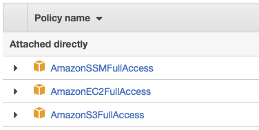
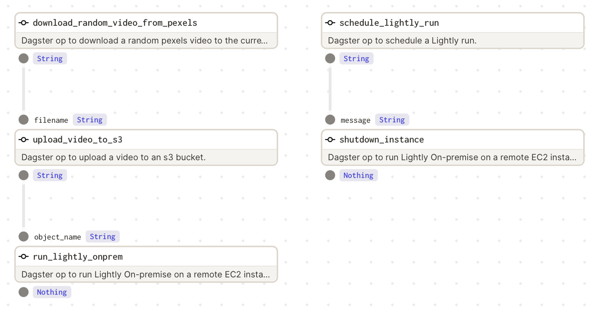

# Data Pre-processing Pipeline on AWS with Dagster 

Data collection and pre-processing pipelines have become increasingly automated in recent years. The Lightly solution is an intelligent system designed to process raw, unlabeled image data, select the most informative samples for labeling, and mitigate dataset bias.

This guide shows how to write a simple automated data pre-processing pipeline that performs the following steps:

- Download a random video from Pexels.
- Upload the video to an S3 bucket.
- Spin up an EC2 instance and start the Lightly Worker waiting for a job to process.
- Schedule a run for the Lightly Worker and wait till it has finished.
- Shutdown the instance

Here, the first two steps simulate a data collection process. For this pipeline, you will use Dagster, an open-source data orchestrator for machine learning. It enables building, deploying, and debugging data processing pipelines. Click [here](https://dagster.io) to learn more.

The structure of the tutorial is as follows:

1. [Prerequisites](#1-prerequisites)
    1. [Setting up the EC2 Instance](#1.1-setting-up-the-ec2-instance)
    2. [Setting up the S3 Bucket](#1.2-setting-up-the-s3-bucket)
    3. [Local Setup](#1.3-local-setup)
2. [Dagster pipeline for processing raw data](#2-dagster-pipeline-for-processing-raw-data)
    1. [Pipeline breakdown](#2.1-pipeline-breakdown)
    2. [Running and visualizing the Pipeline](#2.2-running-and-visualizing-the-pipeline)
    3. [Results](#2.3-results)


## 1 Prerequisites

### 1.1 Setting up the EC2 Instance

The first step is to set up the EC2 instance. For the purposes of this tutorial, it’s recommended to pick an instance with a GPU (like the g4dn.xlarge) and the “Deep Learning AMI (Ubuntu 18.04) Version 48.0” AMI. See [this guide](https://docs.aws.amazon.com/AWSEC2/latest/UserGuide/EC2_GetStarted.html) to get started. Connect to the instance.

Next, you have to [install Lightly Solution](https://docs.lightly.ai/docs/install-lightly). Please follow the instructions. Last, test if the installation on your cloud machine was successful by running the [sanity check](https://docs.lightly.ai/docs/install-lightly#sanity-check):

```
docker run --shm-size="1024m" --rm -it lightly/worker:latest sanity_check=True
```

To run the worker remotely, it’s recommended to write a `run.sh` script with default parameters. Saving the command in a bash file is needed to run the worker in an automated way. 

```
docker run --shm-size="1024m" --gpus all --rm -i \
    -e LIGHTLY_TOKEN={MY_LIGHTLY_TOKEN} \
    lightly/worker:latest \
    worker.worker_id={MY_WORKER_ID}
```

#### Grant Access to instance from SSM

In order to send commands remotely to your instance, you need to grant AWS Systems Manager access to your EC2 Instance. You can do that by following the [AWS official documentation page](https://docs.aws.amazon.com/systems-manager/latest/userguide/setup-instance-profile.html#instance-profile-add-permissions). 

### 1.2 Setting up the S3 Bucket

If you don’t have an S3 bucket already, follow [the AWS official instructions](https://docs.aws.amazon.com/AmazonS3/latest/userguide/create-bucket-overview.html) to create one. You will need two buckets, an `Input` and a `Lightly` bucket in order to work with Lightly. Then you have to [configure your datasource](https://lightly-docs.readme.io/docs/aws-s3#delegated-access) with delegated access in a way that Lightly can access your data.

### 1.3 Local Setup

These steps needs to be done in your local machine, where you will launch your pipeline that remotely controls your instance.

Before you start, install the requirements that can be found in the `requirements.txt` file:

```
pip install -r requirements.txt
```

If you have never done it before, install AWS CLI in your local machine. You can find the tutorial on installing the AWS CLI in your system [here](https://docs.aws.amazon.com/cli/latest/userguide/getting-started-install.html). Test if the installation went out correctly with the following:

```
which aws
aws --version
```

In order to make your local machine control your automated pipeline, you need your local AWS CLI to have the proper permissions. You may need to perform a [quick setup](https://docs.aws.amazon.com/cli/latest/userguide/getting-started-quickstart.html). In particular, be sure to configure it with an [AWS IAM User](https://us-east-1.console.aws.amazon.com/iamv2/home#/users) having the following Amazon AWS managed policies:

- **AmazonEC2FullAccess**: to turn on and off your EC2 machine.
- **AmazonS3FullAccess**: to upload your data on the S3 bucket.
- **AmazonSSMFullAccess**: to remotely run the script.

This should be your resulting AWS CLI user policy list:



If you followed correctly the steps in [Grant Access to instance from SSM](#grant-access-to-instance-from-ssm), you should be now able to reach your instance by SSM. Check if it shows in the SSM list with the following command. Be aware that it can take some hours for an instance to be added to the SSM list.

```
aws ssm describe-instance-information
```

The output should be something similar to this:

```
{
    "InstanceInformationList": [
        {
            "InstanceId": "YOUR-INSTANCE-ID",
            "PingStatus": ...,
            [...]
        }
    ]
}
```

## 2 Dagster pipeline for processing raw data

Dagster pipelines consist of several `ops` which can be chained one after each other in a `job`. You can see here the target `job` schema from `dagit` overview:



You can see that the pipeline is made of five different methods. The steps `(1)` and `(2)` are called in parallel, then the step `(2.1)` will shut down the instance and close the pipeline when the run will end.

1. Download the random video
    1. Upload it to S3
    2. Turn on the instance (if off), and launch Lightly Worker
2. Schedule a Lightly run which sends the selection strategy to the worker
    1. Shutdown the instance at the end of the run

### 2.1 Pipeline breakdown

In the next paragraphs you will find a breakdown of each python file of this repository.

#### ops/pexels.py

It contains `download_random_video_from_pexels` `op` which downloads a random video from Pexels and saves it in the current working directory. Don’t forget to set the `PEXELS_API_KEY`. You can find it [here](https://www.pexels.com/api/new/) after setting up a free account.

#### ops/aws/s3.py

It contains `upload_video_to_s3` `op` which uploads the downloaded video from Pexels to your `Input` bucket. Don’t forget to set the `S3INPUTBUCKET` parameter and the `REGION_NAME`.

#### ops/aws/ec2.py

It contains the `run_lightly_onprem` `op` that turns on your EC2 machine and starts your Lightly worker using your `run.sh` script saved in the `/home/ubuntu/` folder of your EC2 instance, and the `shutdown_instance` `op` that turns off your machine. Don’t forget to set the `INSTANCE_ID` parameter and the `REGION_NAME`. You can find your instance id in the [AWS EC2 page](https://eu-central-1.console.aws.amazon.com/ec2/home?region=eu-central-1#Home:)

#### ops/lightly_run.py

The following code is the content of `lightly_run.py`. It contains the `run_lightly_onprem` `op` that [schedules a run](https://docs.lightly.ai/docs/run-your-first-selection) and monitors it via the Lightly APIs. The `selection_config` will make the Lightly Worker choose *10%* of the frames from the initial video that are as diverse as possible. This is done using the embeddings, which are automatically created during the run. Don’t forget to set all the needed parameters.

#### aws_example_job.py

It puts everything together in a `dagster job`. 

### 2.2 Running and visualizing the Pipeline

Dagit allows to visualize pipelines in a web interface. The following command shows the above pipeline on *127.0.0.1:3000*:

```
dagit -f aws_example_job.py
```

You can execute the pipeline with the following command:

```
dagster pipeline execute -f aws_example_job.py
```

### 2.3 Results

You can see the selection results directly from [Lightly's interface](https://app.lightly.ai) and download them as filenames or as a labeling task.